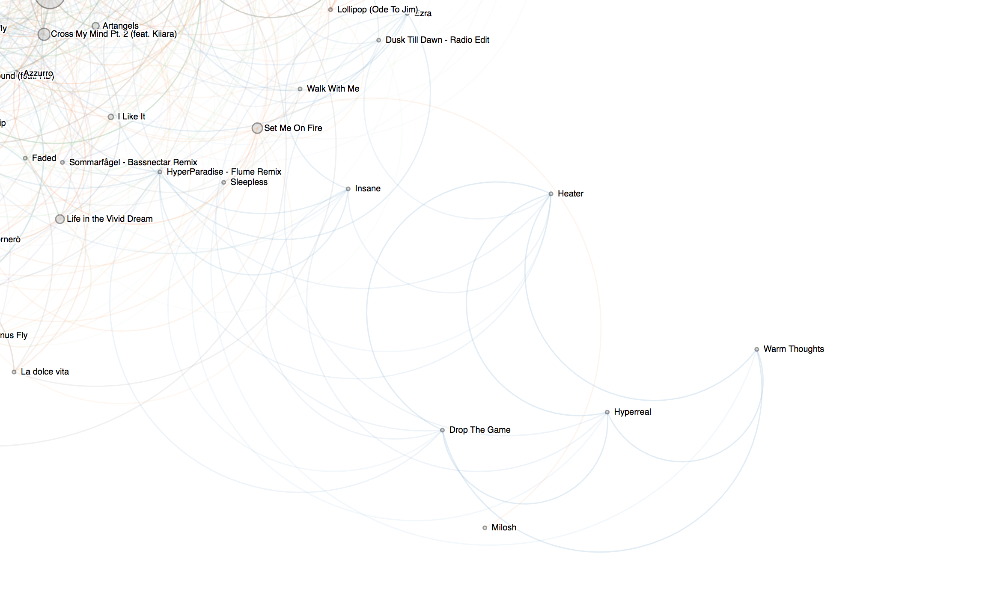
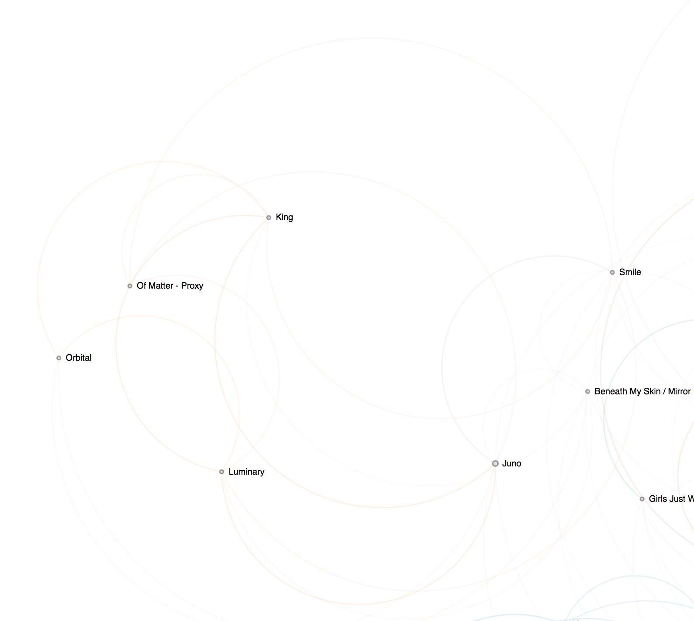
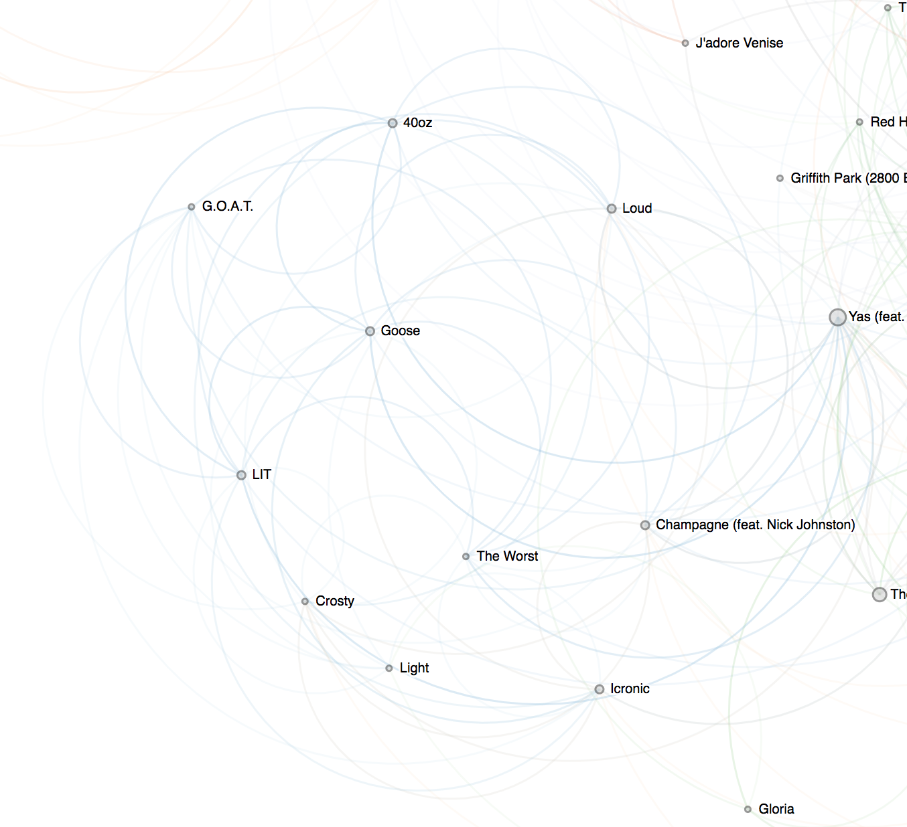
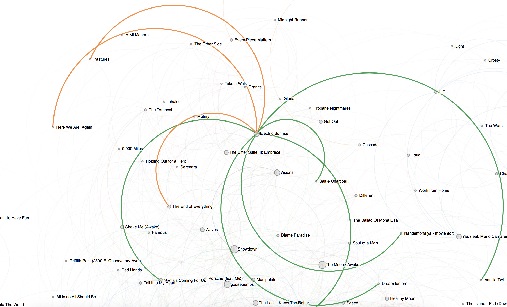
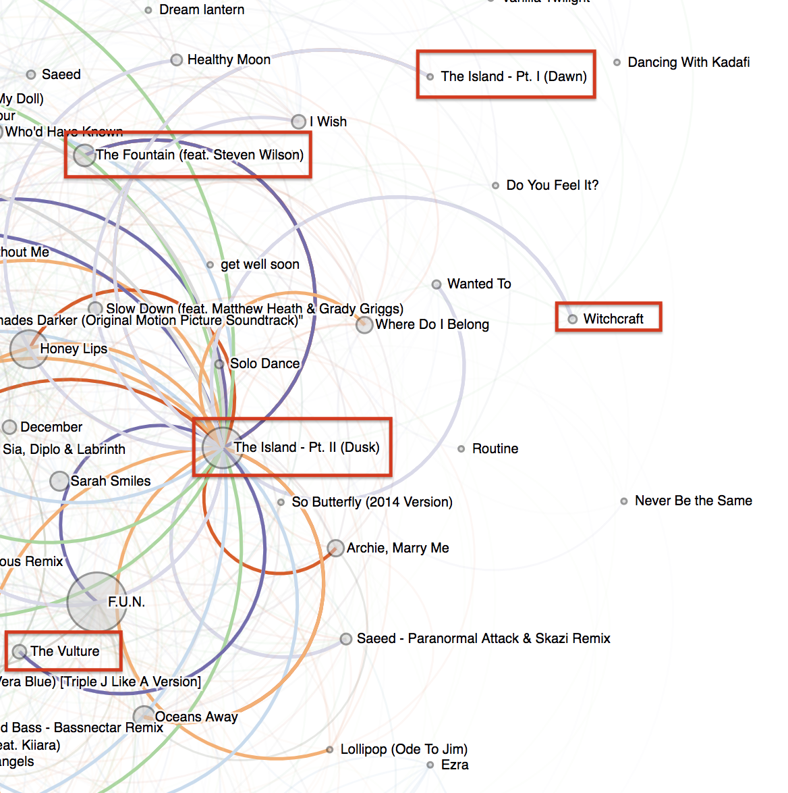

# Visualizing Spotify Listening Patterns

I wanted to write up a quick summary of my methodology and takeaways for the [data visualization](https://christaina.github.io/spotify_autoplayist/graph_viz/) of my Spotify listening history. There's a lot of stuff I'd like to do/fix in the future so I want to outline that here as well.

## Motivation

I listen to music on Spotify every day. I have this habit where I'll queue up a bunch of songs based on my mood when I know I'm going to be listening to music for awhile instead of using a playlist. Several things affect what I put on--like what I'm doing (biking, working, going on a walk), and what I'm into at the moment.

I thought it would be interesting to see what songs often appear together in the same "listening session", and eventually use that to automatically generate playlists for myself based on patterns. For now, I've just created a graph visualization of my listening patterns using [D3's force directed graph](https://github.com/d3/d3-force).

## Methodology

### Collecting data

I collected my listening history from [Spotify's Web API](https://developer.spotify.com/documentation/web-api/) using the [spotipy](https://github.com/plamere/spotipy) Python library. Because Spotify only lets you access your last 50 recently played songs, I automated a script on my friend's server that checks for new songs every hour and appends this to a CSV of listening history.

I collect the song and artist name, song id, and time it was played.

```
artists,explicit,id,name,played_at
"Bassnectar, Jantsen, RD",False,3wWOi4PlqODQJVhN6PY2lQ,Heavyweight Sound (feat. RD),2018-10-04T21:36:32.794Z
"Gogol Bordello, Bassnectar",False,7n438weMmNV8rnv91GCyZP,Immigraniada - Bassnectar Remix,2018-10-04T21:31:55.203Z
Bassnectar,False,2MdbVjVnZORe2ZH3OSb8VL,Flash Back,2018-10-04T21:30:03.151Z
"Bassnectar, At Dawn We Rage",False,6t1Sdcuk0s3BPtgtel5b5F,Flash Back (At Dawn We Rage Remix),2018-10-04T21:25:51.308Z
```

### Making a graph

I wanted to create a graph that would capture the sessions in which I listen to music. My current approach is more of a heuristic based on my exploration of the data and my knowledge of my own listening patterns. I did all of this processing in Python and used the [networkx package](https://networkx.github.io/) to create the graph.

1. Calculate the time between when a song started and when the song after it started, `song_dist`. If `song_dist <= session_threshold`, then the two songs belong to the same listening session. When `song_dist > session_threshold`, put all songs after that in a new listening session.

2. Get all pairs of songs within a session

3. Select a threshold on the number of songs played between a pair. Filter to only include pairs such that the number of songs played between this pair in that session is less than this threshold.

4. Create a graph where nodes are individual songs, and edges are drawn between pairs in the dataset created above.

5. Filter graph to only include songs with more than a certain amount of listens by me.

These decisions are motivated by not wanting the graph to be too slow to visualize or too chaotic to read.


## Analysis

The data visualization highlights several listening patterns that I want to point out:

### Listening to a single artist

In the case when I am checking out a new artist, I'll just listen to one of their albums or their popular tracks on Spotify. I'll listen to a lot of different songs until I find specific ones I like.


Listening to Flume (this is actually my own Flume playlist that I put on sometimes)


Listening to tessarect


Listening to Polyphia--I was going to go to a concert of theirs and a friend made me a playlist of their music.

After listening to several songs from an artist I usually find one in particular that I really like. I had been listening to Plini, and really started to like their song **Electric Sunrise**. You can see that I had been listening to a lot of Plini songs in the same session (orange edge), but then started listening to Electric Sunrise outside of just listening to Plini.



### My Popular Songs

I have songs that I'll listen to every day no matter what the context is. Right before I started this project, I went to a Bassnectar concert. I got super in Bassnectar and have been listening to **You & Me** and **F.U.N.** pretty much all the time--which is why they're the biggest and most connected nodes in this graph. I also listen to them consecutively most of the time, which is why there is a heavy line between them (the graph is designed such that more consecutive listens=darker).


I also listen to the album Immersion by Pendulum a lot. Sometimes, I'll just put on a bunch of songs in this album (explains why they're close to one-another in the graph). But I'll also put on my extra favorite songs from the album in many contexts. Songs like The Vulture, The Fountain, and The Island - Pt. II) are closer to the center of the graph and more densely connected, while still being close to other songs from this album.



## Last Thoughts

I wanted to see if a graph of my song history would actually show anything interesting about my listening patterns. Even using simple heuristics to create a graph, I could recognize relationships between songs. I can use this to go forward inform the methods I use build a model to generate playlists, and it's also fun to look at.

## Future Work

- My current method for identifying a session is based on a threshold on the length of time between when a song started and when the next song started. If I were to listen to a 10-minute long song, if I made this threshold too long it would not count it in the same group. This also causes problems if I want to weight songs based on how close they were listened together. Need to find a way around this.

- Make graph interactive so that people can change the parameters on how the graph is generated. This would involved generating the graph in JS instead of in Python.

- Analyze how my current approach scales when my music listening history grows

- Actually generate playlists based on listening sessions. I see several ways to do this:

  - Do some clustering on songs based on features I create (ideas: the listening session, the time of day, the number of times I've listened in the past week). I would want it to be possible to have the same song appear in different clusters, though.

  - Classifiction model where the label is "should this song be in this playlist?". I would need to define what "this playlist" is--my workout playlist, my bike to/from work playlist, etc. It wouldn't be too difficult to label data because I could just pull out different "sessions" using the threshold method I used for the graph, and label the session by what I was doing at the time. This is an easy way to label a lot of songs. I could create features like the ones I described for the clustering above and use those.
